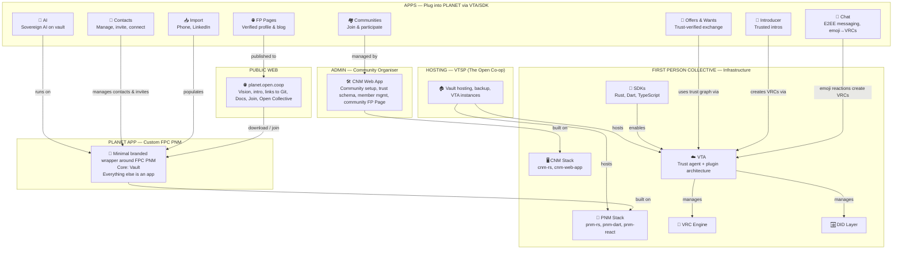

# Specifications

**PLANET App is a minimal wrapper.** It's a branded version of the First Person Co-op Personal Network Manager (PNM) with a vault, contacts, messaging and alerts. All other functionality (introductions, FP Pages, etc.) is delivered as separate apps that plug in via the VTA/SDK layer.

**Apps connect to VTA directly.** This keeps the architecture modular — apps can be added, removed, or replaced independently.

**CNM is separate.** Community organisers use the CNM web app to manage their communities. It's not an app within PLANET — it's a parallel tool for admins.

# Ecosystem Map

**Status:** [DRAFT] — Needs review and validation with FPC team.

How PLANET's components relate to each other and to the First Person Collective (FPC) stack. Defines what PLANET builds vs. what FPC provides.

## Open Questions

- Exact boundary between PLANET experience layer and FPC frontends
- How does the VTA plugin architecture work in practice? Need FPC documentation.
- How do apps discover and interact with each other via VTA/SDK?
- What's the app installation/enablement model? Pre-installed? App store? Community admin enables?

