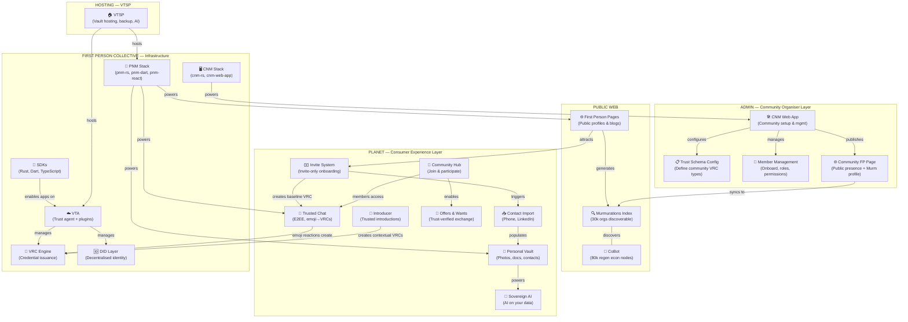
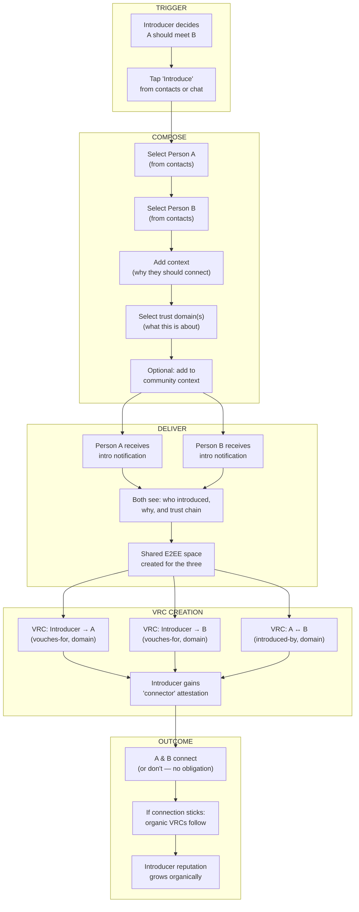
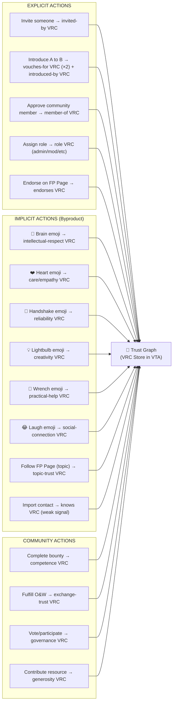

# PLANET UX Design System
## Layered Interaction Architecture — v0.1 (March 2026)

> **Purpose:** Strategic UX planning document for PLANET — the consumer-facing trust network built on the First Person Collective stack. This document maps all major user flows across four layers of detail, enabling coordinated development between the PLANET team and First Person Collective developers.

> **How to use:** Start at Layer 0 (ecosystem), drill into Layer 1 (journeys), then into Layer 2 (specific flows). Each Layer 2 flow links to Layer 3 user stories/specs. Work through flows in priority order — not everything needs designing at once.

---

## Layer 0: Ecosystem Map

How PLANET's components relate to each other and to the First Person Collective (FPC) stack.

### Key Insight

PLANET builds **above** the FPC stack. We don't rebuild the PNM or CNM — we design the *experience patterns* and *trust mechanics* that make them compelling for normal humans. Our design work focuses on the purple and blue layers; the green layer is Affinidi/FPC's domain.

---

## Layer 1: Journey Maps

Three primary journeys. Each journey has multiple phases, and each phase contains specific flows that are detailed at Layer 2.

---

### Journey 1: Individual Onboarding & Daily Life (PNM)

The path from "I got an invite" to "I can't imagine going back to WhatsApp."

```mermaid
graph LR
    subgraph "PHASE 1: ARRIVAL"
        A1["Receive invite<br/>from trusted contact"]
        A2["View inviter's<br/>FP Page (public web)"]
        A3["Accept invite<br/>(create DID)"]
        A4["Set up profile<br/>(minimal — name, photo)"]
        A5["First VRC created<br/>(invited-by credential)"]
    end

    subgraph "PHASE 2: SEEDING"
        B1["Import contacts<br/>(phone / LinkedIn)"]
        B2["See who's already<br/>on PLANET"]
        B3["Invite close circle<br/>(family first)"]
        B4["First conversation<br/>(1:1 or family group)"]
        B5["Vault basics<br/>(photo backup begins)"]
    end

    subgraph "PHASE 3: DAILY USE"
        C1["Chat with contacts<br/>(E2EE messaging)"]
        C2["React with emojis<br/>(implicit VRC creation)"]
        C3["Make introductions<br/>(Introducer flow)"]
        C4["Browse FP Pages<br/>(follow for topics)"]
        C5["AI on your vault<br/>(search, organise, ask)"]
    end

    subgraph "PHASE 4: COMMUNITY"
        D1["Discover communities<br/>(via contacts / Murm)"]
        D2["Join community<br/>(admin approves)"]
        D3["Participate in<br/>community chat"]
        D4["Community O&W<br/>(offers & wants)"]
        D5["Create own FP Page<br/>(public presence)"]
    end

    subgraph "PHASE 5: DEEPENING"
        E1["Multiple communities"]
        E2["Rich trust graph<br/>(visible reputation)"]
        E3["Co-op membership<br/>(voting rights)"]
        E4["Invite others<br/>(become connector)"]
        E5["Trust-based<br/>discovery & exchange"]
    end

    A1 --> A2 --> A3 --> A4 --> A5
    A5 --> B1 --> B2 --> B3 --> B4 --> B5
    B5 --> C1 --> C2 --> C3 --> C4 --> C5
    C5 --> D1 --> D2 --> D3 --> D4 --> D5
    D5 --> E1 --> E2 --> E3 --> E4 --> E5
```

#### Layer 2 Flows (to detail):

| ID | Flow | Phase | Priority | Status |
|----|------|-------|----------|--------|
| PNM-01 | Invite receipt & acceptance | Arrival | 🔴 Critical | To design |
| PNM-02 | DID creation & profile setup | Arrival | 🔴 Critical | To design |
| PNM-03 | Contact import (phone) | Seeding | 🔴 Critical | To design |
| PNM-04 | Contact import (LinkedIn) | Seeding | 🟡 High | To design |
| PNM-05 | Send invite to contact | Seeding | 🔴 Critical | To design |
| PNM-06 | First conversation setup | Seeding | 🔴 Critical | FPC scope |
| PNM-07 | Emoji reaction → VRC creation | Daily Use | 🔴 Critical | To design |
| PNM-08 | Introducer flow | Daily Use | 🔴 Critical | To design |
| PNM-09 | Follow FP Page (topic trust) | Daily Use | 🟡 High | To design |
| PNM-10 | FP Page creation & publishing | Community | 🟡 High | To design |
| PNM-11 | Community discovery & joining | Community | 🟡 High | To design |
| PNM-12 | Vault setup & photo backup | Seeding | 🟢 Medium | To design |
| PNM-13 | AI assistant first use | Daily Use | 🟢 Medium | To design |
| PNM-14 | Co-op membership activation | Deepening | 🟢 Medium | To design |
| PNM-15 | Trust graph visualisation | Deepening | 🟢 Medium | To design |

---

### Journey 2: Community Organiser Setup & Management (CNM)

The path from "I want my community on PLANET" to "our community is thriving here."

```mermaid
graph LR
    subgraph "PHASE 1: SETUP"
        F1["Request community<br/>space (via CNM)"]
        F2["Define community<br/>purpose & rules"]
        F3["Configure trust<br/>schema (VRC types)"]
        F4["Set up community<br/>FP Page"]
        F5["Create Murm profile<br/>(if discoverable)"]
    end

    subgraph "PHASE 2: SEEDING"
        G1["Invite founding<br/>members"]
        G2["Assign roles<br/>(admin, mod, member)"]
        G3["First community<br/>conversation"]
        G4["Enable features<br/>(O&W, events, etc)"]
        G5["Onboarding message<br/>& guidelines"]
    end

    subgraph "PHASE 3: GROWTH"
        H1["Member referrals<br/>(invite chains)"]
        H2["Cross-community<br/>introductions"]
        H3["Community FP Page<br/>content (blog)"]
        H4["Trust graph<br/>density builds"]
        H5["Enable advanced<br/>features (AI, apps)"]
    end

    subgraph "PHASE 4: MATURITY"
        I1["Governance<br/>(proposals, votes)"]
        I2["Community economy<br/>(O&W, mutual credit)"]
        I3["Inter-community<br/>federation"]
        I4["Data & insights<br/>(community health)"]
        I5["Sustainability<br/>(member contributions)"]
    end

    F1 --> F2 --> F3 --> F4 --> F5
    F5 --> G1 --> G2 --> G3 --> G4 --> G5
    G5 --> H1 --> H2 --> H3 --> H4 --> H5
    H5 --> I1 --> I2 --> I3 --> I4 --> I5
```

#### Layer 2 Flows (to detail):

| ID | Flow | Phase | Priority | Status |
|----|------|-------|----------|--------|
| CNM-01 | Community creation & purpose definition | Setup | 🔴 Critical | To design |
| CNM-02 | Trust schema configuration | Setup | 🔴 Critical | To design |
| CNM-03 | Community FP Page setup | Setup | 🟡 High | To design |
| CNM-04 | Murmurations profile generation | Setup | 🟡 High | To design |
| CNM-05 | Founding member invitation | Seeding | 🔴 Critical | To design |
| CNM-06 | Role assignment & permissions | Seeding | 🟡 High | FPC scope |
| CNM-07 | Feature enablement (apps/plugins) | Seeding | 🟢 Medium | To design |
| CNM-08 | Member approval workflow | Growth | 🟡 High | To design |
| CNM-09 | Community health dashboard | Maturity | 🟢 Medium | To design |
| CNM-10 | Inter-community federation | Maturity | 🟢 Medium | To design |

---

### Journey 3: The Introducer Flow (Bridges PNM & CNM)

The specific interaction of introducing two people, creating trust, and building graph density.

#### Layer 2 Flows (to detail):

| ID | Flow | Priority | Status |
|----|------|----------|--------|
| INTRO-01 | Introduction composition & sending | 🔴 Critical | To design |
| INTRO-02 | Introduction receipt & acceptance | 🔴 Critical | To design |
| INTRO-03 | VRC schema for introductions | 🔴 Critical | To design |
| INTRO-04 | Trust domain selection UX | 🟡 High | To design |
| INTRO-05 | Three-way space creation | 🟡 High | FPC scope |
| INTRO-06 | Introduction outcome tracking | 🟢 Medium | To design |
| INTRO-07 | Community-context introductions | 🟢 Medium | To design |

---

## VRC Creation Map

How VRCs are created across all interactions — the trust graph's "source of truth."

---

## Trust Domains Taxonomy (Draft)

Trust is not one-dimensional. These domains allow the graph to capture *what kind* of trust exists.

| Domain | Emoji | Created By | Meaning |
|--------|-------|-----------|---------|
| Intellectual | 🧠 | Reaction, endorsement | "This person thinks well" |
| Empathy | ❤️ | Reaction | "This person cares" |
| Reliability | 🤝 | Reaction, O&W completion | "This person follows through" |
| Creativity | 💡 | Reaction, endorsement | "This person has original ideas" |
| Practical | 🔧 | Reaction, O&W, bounties | "This person gets things done" |
| Social | 😂 | Reaction | "This person is good company" |
| Professional | 🏢 | Introduction, endorsement | "I'd work with this person" |
| Community | 🌱 | Membership, governance | "This person contributes to community" |
| Connector | 🔗 | Introductions made | "This person connects people well" |

### Accumulation Rules (to define at L3):
- Micro-VRCs from emojis accumulate but have a decay/recency weight
- A single brain emoji is trivial; 50 from 20 different people is significant
- Cross-community attestations carry more weight than within-community
- Explicit actions (introductions, endorsements) carry more weight than implicit (emojis)
- No public "score" — trust is always contextual and relational

---

## Priority Sequence for Layer 2 Design

Based on what's needed for September launch with founding communities:

### Sprint 1 (March): Core Onboarding
- **PNM-01** Invite receipt & acceptance
- **PNM-02** DID creation & profile setup
- **PNM-05** Send invite to contact

### Sprint 2 (April): Seeding & Connection
- **PNM-03** Contact import (phone)
- **PNM-08** Introducer flow (full detail)
- **INTRO-01 to INTRO-04** Introduction composition, receipt, VRC schema, trust domains

### Sprint 3 (May): Daily Engagement
- **PNM-07** Emoji reaction → VRC creation
- **PNM-09** Follow FP Page (topic trust)
- **PNM-10** FP Page creation & publishing

### Sprint 4 (June): Community Layer
- **CNM-01** Community creation
- **CNM-02** Trust schema configuration
- **CNM-05** Founding member invitation
- **PNM-11** Community discovery & joining

### Sprint 5 (July): Polish & Depth
- **CNM-03** Community FP Page + Murm integration
- **PNM-12** Vault & photo backup
- **PNM-13** AI assistant first use

### Sprint 6 (August): Beta Testing
- Integration testing with founding communities
- Iterate based on feedback
- VTSP infrastructure deployment

---

## Design Principles

1. **Trust as byproduct.** Users never think "I am issuing a credential." They think "nice point" and tap a brain emoji. The trust graph builds itself.

2. **Invitation, not marketing.** Every member arrives because someone they trust invited them. No landing page, no sign-up form. This is deliberate — it ensures the graph starts with real relationships.

3. **Progressive disclosure.** Day 1: chat with your people. Week 1: discover communities. Month 1: your trust graph is rich enough to enable discovery and exchange. Don't front-load complexity.

4. **No trust scores.** Trust is always contextual, relational, and multidimensional. "Sarah trusts Oli's thinking on energy policy" is useful. "Oli has a trust score of 7.3" is meaningless and gameable.

5. **Cooperative by design.** Every member is a potential co-op member. The interface should make cooperative governance feel natural, not bureaucratic.

6. **Public hooks, private depth.** FP Pages are public (they attract new members). Everything else is private and consent-based. The public surface drives growth; the private depth creates value.

---

## Changelog

| Date | Version | Changes |
|------|---------|---------|
| 2026-03-03 | 0.1 | Initial L0 + L1 maps, trust domain taxonomy, priority sequence |

---

*This is a living document. Each Layer 2 flow will be developed as a separate linked document with detailed wireframes, user stories, and VRC schemas.*
